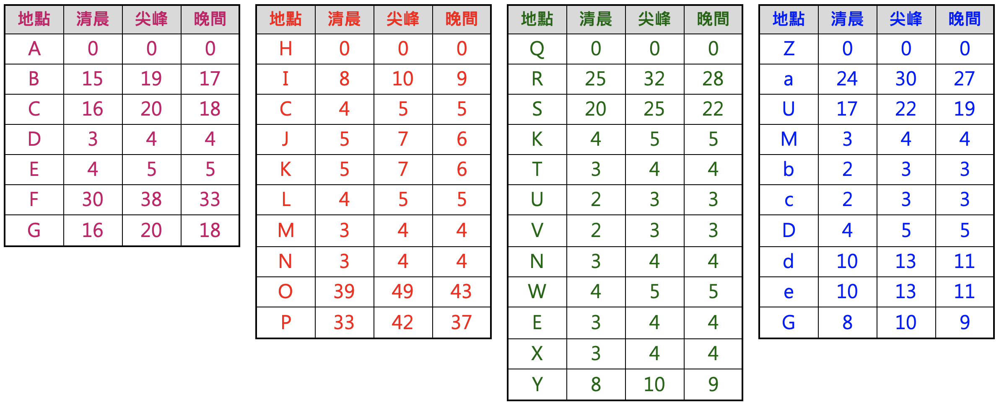

# Route planning based on time constraints

**作品名稱：** 在不同時段限制下的路徑規劃
	
**動機：** 該作品為本人在修讀人工智慧課程時的程式作業(該作業還有兩位同學參與，但程式大部分都為自己本人撰寫，同學幫忙除錯與確認答案正確與否)，為教授為了檢驗學生對於UCS(Uniform Cost Search)、Ａ*與GA(Genetic Algorithm)演算法的理解程度，並懂的如何使用該技術。

**開發環境：** Python

**題目解說：** 題目為有四條雙向的交通路網，將分別以紫色、紅色、綠色和藍色表示，在地圖上有A-Z的節點，並規定好結點間的連結狀況。但是為了反映實際真實道路車輛行走時間，將一天中分成三個時段，分別為00:00:00-07:59:59、08:00:00-16:59:59、17:00:00-23:59:59。不同時間點，車輛通行同路線所需花費時間皆不盡相同(可通行路線及耗費時間，運用相鄰建置完於程式中)，相關路線通勤資訊呈現於下表。另一方面，紅色與綠色路線於N和Ｋ有交集、紅色與紫色路線於C有交集、藍色與紫色路線於G和D有交集、綠色與紫色路線於E有交集、藍色與綠色路線於U有交集、藍色與紅色路線於M有交集。請在給予通行時間、起點與終點的要求下，尋找路網中最快通行路線。

<br>
<div align="center">
	
</div>
<br>

**解題演算法：** 
主要運用三種方法來進行解題，分別如下所示：
<br>
1. 關於prob1.py，是採用UCS演算法撰寫而成。
2. 關於prob2.py，是使用Ａ*演算法撰寫而成，在評價節點的Cost時的ｈ(n)函數，本作業是採用AllPairs的演算法去計算最短路徑。
3. 關於prob3.py，主要是透過使用者輸入必須經過的節點，來作為基因序列，創建、交配與突變，但是當基因序列小於等於三時，則會透過切一刀，兩兩基因相同位置進行置換。基因序列點與點間的成本及中繼點位，則是透過UCS演算法來尋求。
<br>
請使用命令提示字元或終端機執行，指令如下：
<br>

```python
python prob1.py StartTime StartNode GoalNode
```

計算結果，如([BCJKS],39)，其中[BCJKS]為所經過的節點，39為耗費時間。
